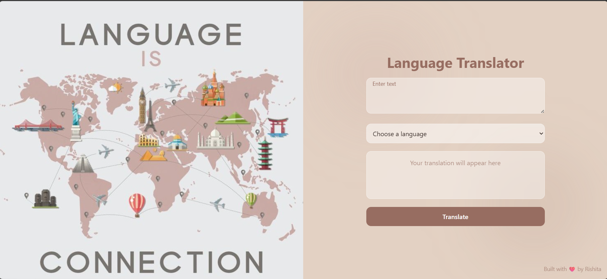

# Language Translator App

A modern and responsive **Language Translator Web App** built using **React + Tailwind CSS**.  
It allows users to translate English text into multiple languages with a clean UI and smooth user experience.

---

## Features

- Translate text into multiple languages
- Clean and modern UI 
- Fully responsive (Mobile + Desktop)
- Real-time translation using API
- Copy translated text with one click
- Smooth animations & typing effect
- User-friendly UX (no alerts, inline messages)

---

## Tech Stack

- React (Frontend)
- Tailwind CSS (Styling)
- RapidAPI
- Vite (Build tool)

---

## 📸 Preview

---
### API Used
- This project uses the RapidAPI (Deep Translate)..

### Future Improvements
- Auto language detection
- Voice input support
- Translation history
- English written for non readable languages like korean, chinease, etc.

### Acknowledgements
Built to explore:
- API integration
- React fundamentals
- UI/UX design principles
